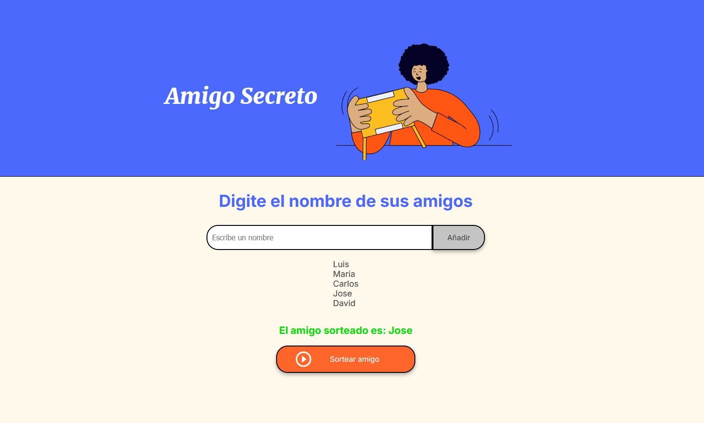

# 
 Challenge Amigo Secreto - ONE Alura Latam

## **Descripción del proyecto**

Challenge "Amigo Secreto" realizado como parte de la formación ONE Alura Latam

En este desafío, se desarrolló una aplicación que permita a los usuarios ingresar nombres de amigos en una lista para luego realizar un sorteo aleatorio y determinar quién es el **"amigo secreto"**.
El usuario deberá agregar nombres mediante un campo de texto y un botón **"Adicionar"**. Los nombres ingresados se mostrarán en una lista visible en la página, y al finalizar, un botón **"Sortear Amigo"** seleccionará uno de los nombres de forma aleatoria, mostrando el resultado en pantalla.

## **Funcionalidades del proyecto**

* **Agregar nombres:** Los usuarios escriben el nombre de un amigo en un campo de texto y lo agregarán a una lista visible al hacer clic en **"Adicionar"**.
* **Validar entrada:** Si el campo de texto está vacío, el programa muestra una alerta pidiendo un nombre válido.
* **Visualizar la lista:** Los nombres ingresados aparecen en una lista debajo del campo de entrada.
* **Sorteo aleatorio:** Al hacer clic en el botón **"Sortear Amigo"**, se selecciona aleatoriamente un nombre de la lista y se muestra en la página.

## **Tecnologias utilizadas**
- Html
- CSS
- JavaScript

## **Autor**
| [ Jose B. (jbcodedev)](https://github.com/jbcodedev)|
| :---: |